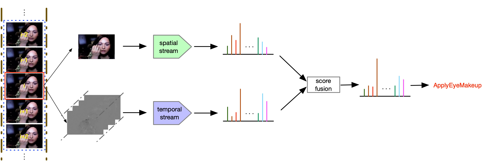
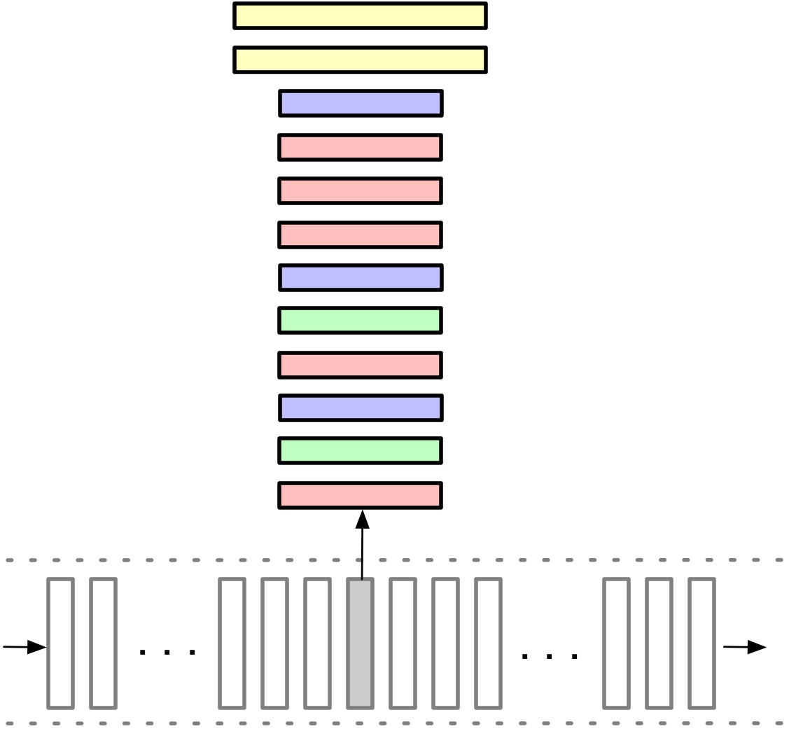
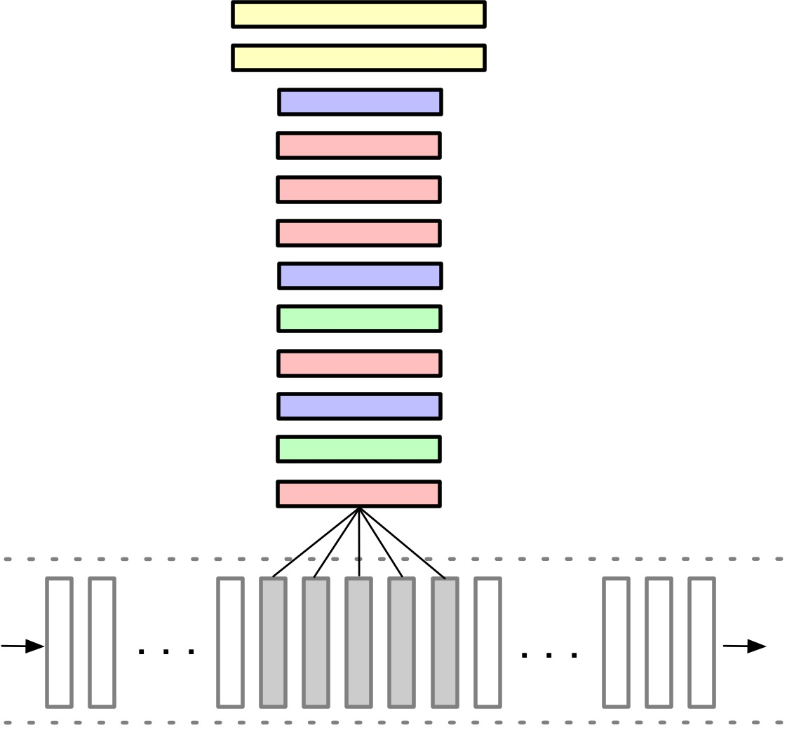
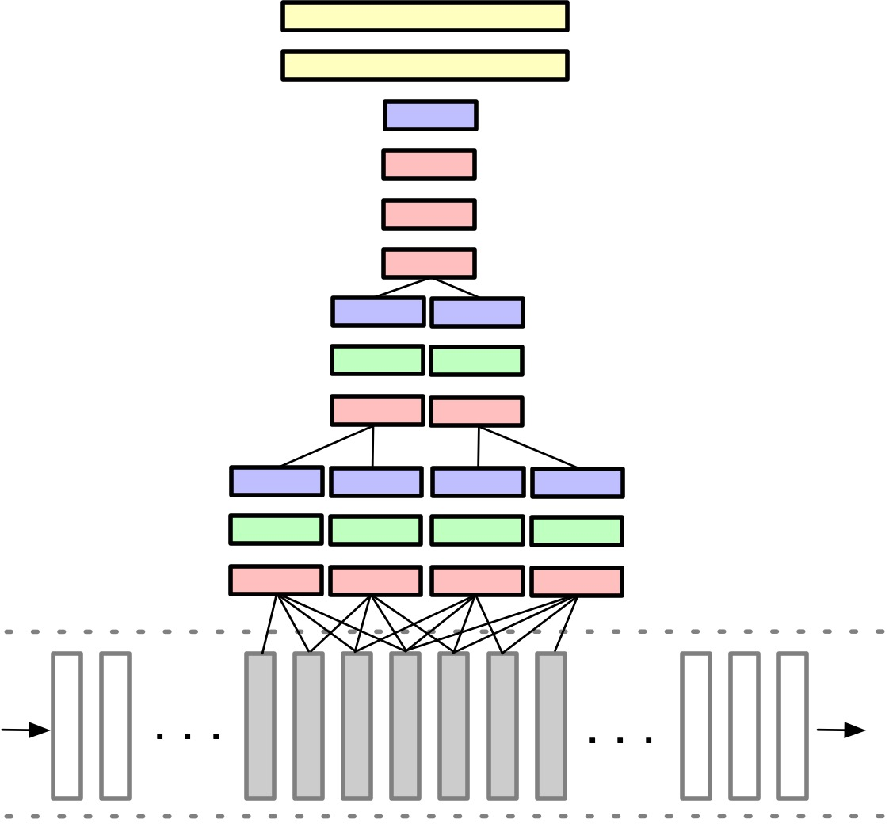
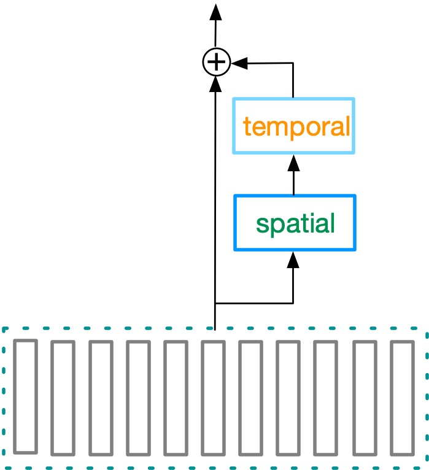
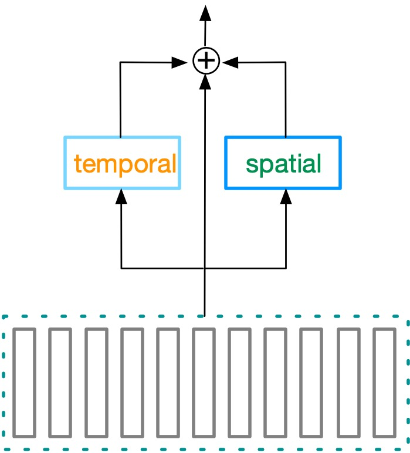
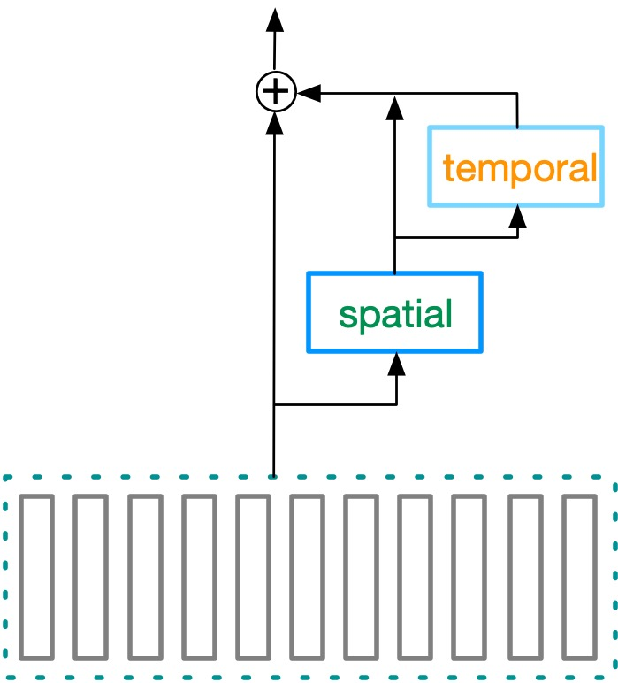
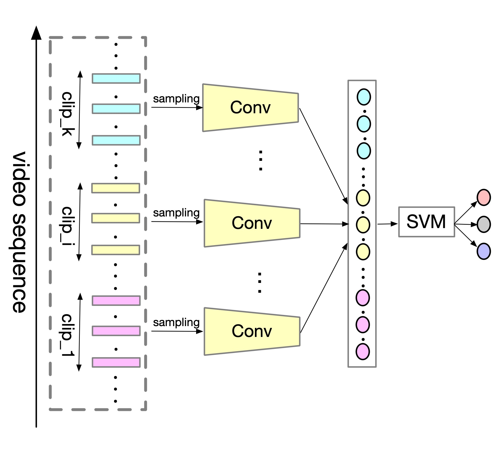
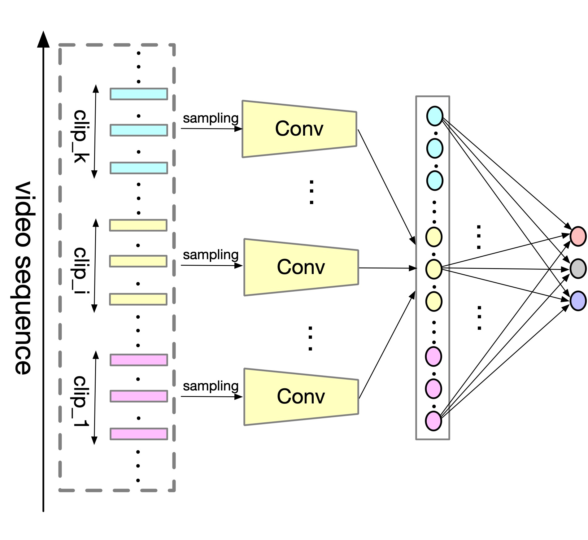
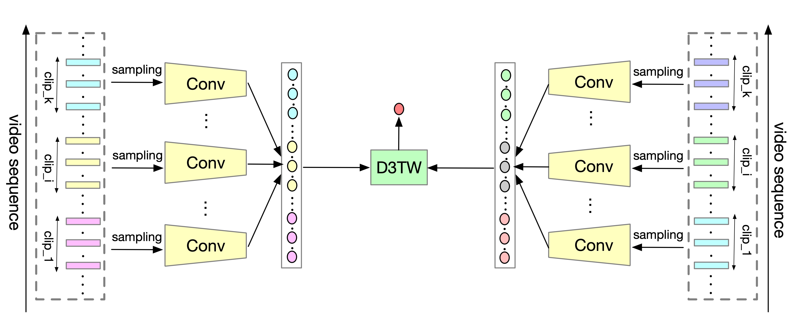

# survey taxonomy

In our survey paper, we group the approaches based on deep learning into three categories, e.g. sequence-based, view-based, depth-based. For the sequence-based approaches, their intrinsic characteristic is transforming the sequences with variable length to fixed dimension label. For the view-based approaches, which focus on the generation, combination and factorization of different views. For the depth-based approaches, they study the transformation of representation from one space to another.

# Introduction
This repo contains the brief introduction of our survey paper : A Gentle Review of Deep Learning based Human Activity Recognition. In this section we will introduce the outline of each categories.

## Sequence-based
In this section, we list the two streams of methods that transform the sequence with variable length to fixed dimension. One is RNN(LSTM)-related approaches, the other is temporal aggregation related approaches.

### Recurrent Nets and Attention Mechanism
Recurrent networks are ad hoc for sequential input, e.g. video, signal.

### Temporal Aggregation
Sampling and pooling are two major ways of temporal aggregation.
For sampling, it is the most intuitive method to convert a flexible length sequence to fixed-length representation by taking the constant number of observations from a sequence. We group the tricks that based on sampling into five classes, e.g. random sampling, uniform sampling, segment random sampling, shot-based sampling and adaptive sampling. Following figs illustrate those sampling tricks.

a.random sampling

b. uniform sampling

c. segment random sampling

d. shot-based sampling

e. adaptive sampling

Pooling as the common component CNNs, which performs on features to to generate the more semantic features. We classify pooling-based approaches into three groups, e.g. local pooling(left), global pooling(middle), slow pooling(right), according to the place and the times a pooling operation was executed.
<table style="border:0px">
   <tr>
       <td></td>
       <td></td>
       <td></td>
</table>

## View-based
In this section, we focus on the approaches utilizing information from multi-views to recognize the human activities. For our survey paper, we initially pay attention to the two ways of view generation: from diverse sensor and various hand-crafted descriptors.

### Augmentation
Video is an example which contains multiple views in the way that views can be  characterized with respect to vision , audio, subtitles, and even attached comments. For activities recognization using signal data, there are audio, accelerometerm gyroscope, ambient sensor, electrocardiograph, RFID, used in deep learning methods.Two-streams is a famous and typical approach, which used both RGB-frame stream and the optical flow stream as the input of model. The pipeline of two-stream is depicted in following figure.

### Combination
In this subsection, we reveal various methods that fuse views. Compared with single-view/frame based approach, researchers extend the idea of temporal fusion into: early fusion, late fusion and slow fusion, those ideas are depicted in following figure(from left to right : single-view, early fusion, late fusion and slow fusion).
<table style="border:0px">
   <tr>
       <td></td>
       <td></td>
       <td></td>
       <td></td>
</table>

### Factorization
As the structures with 3D convolutions become more complex, the training takes serious computational cost and memory demand. To mitigate the cost, there are a series of articles trying to factorize 3D kernels into 2D kernels and 1D kernels(from left to right : series connect, parallel connect and hybrid connect).
<table style="border:0px">
   <tr>
       <td></td>
       <td></td>
       <td></td>
</table>

## Depth-based
In this section, we study the transformations from one vector space to another vector space. Before deep learning era, common approaches process feature extractors and classifiers independently. Influenced by that, deep learning was initially used as a feature extractor with a non-neuron classifier.
<table style="border:0px">
   <tr>
       <td></td>
       <td></td>
       <td></td>
</table>
