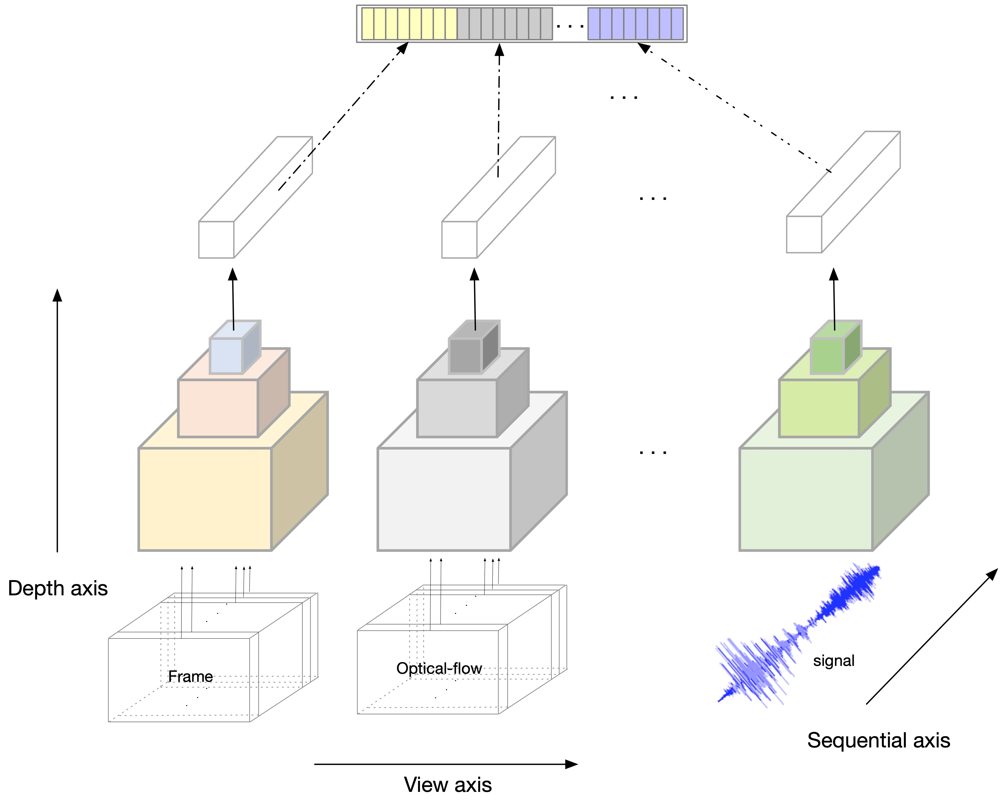

# human activity recognition survey

<table style="border:0px">
   <tr>
       <td></td>
   </tr>
</table>

## Introduction
This repo contains several models for video action recognition,
including C3D, R2Plus1D, R3D, inplemented using PyTorch (0.4.0).
Currently, we train these models on UCF101 and HMDB51 datasets.
**More models and datasets will be available soon!**
