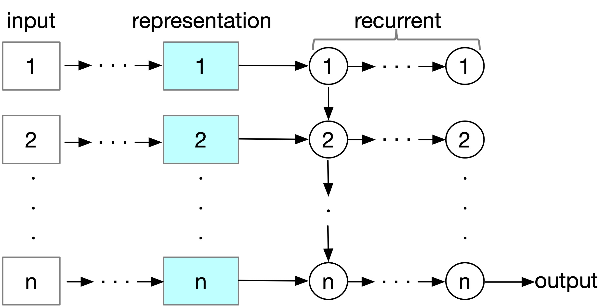
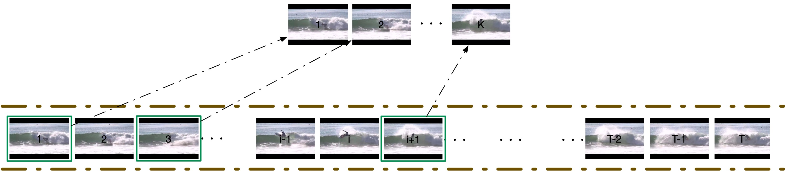
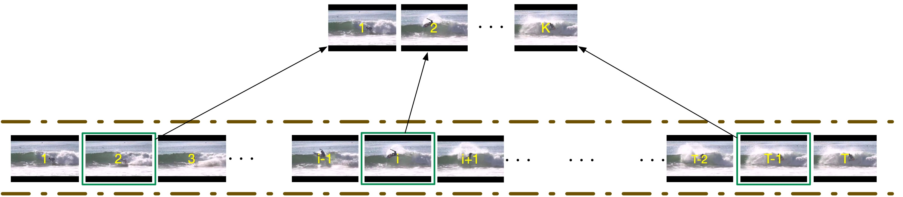
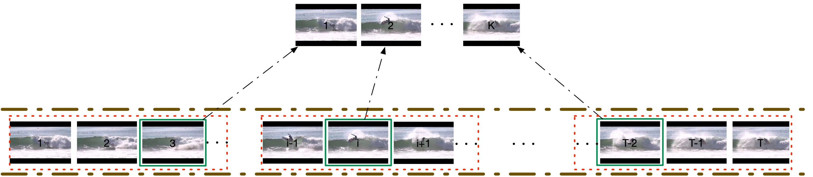
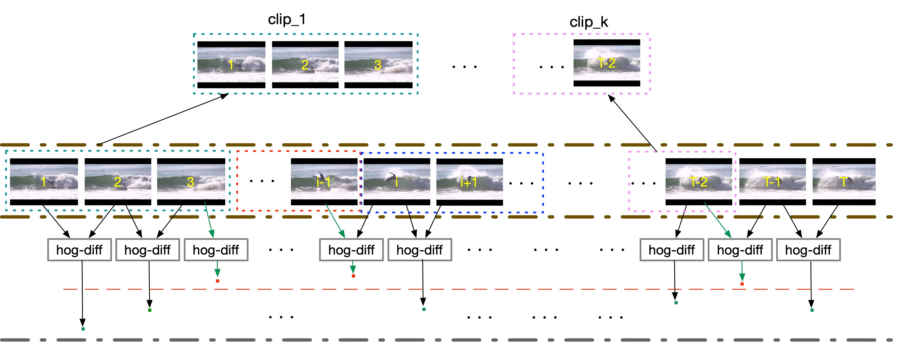
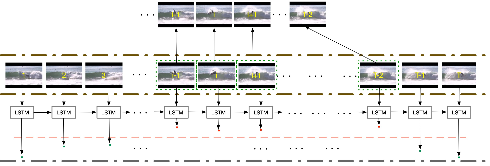
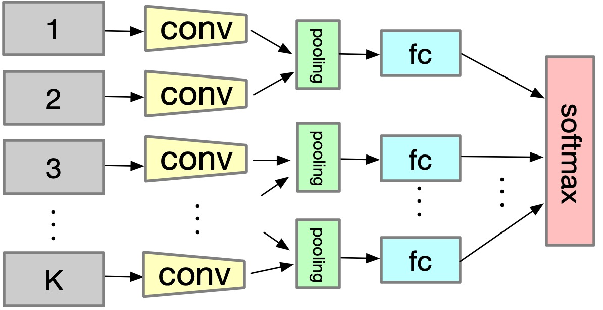
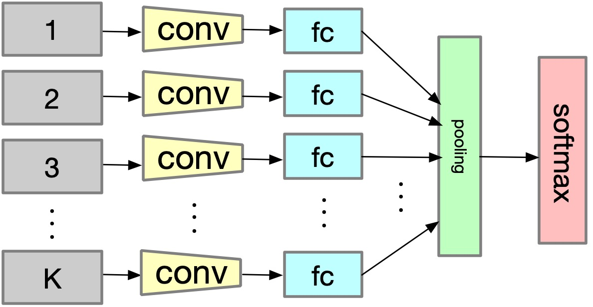
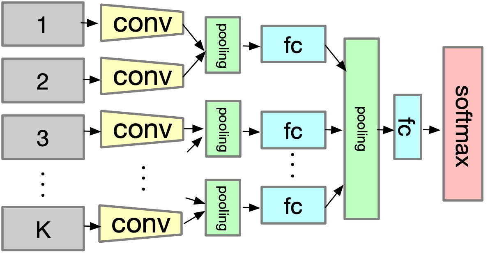

# survey taxonomy

In our survey paper, we group the approaches based on deep learning into three categories, e.g. sequence-based, view-based, depth-based. For the sequence-based approaches, their intrinsic characteristic is transforming the sequences with variable length to fixed dimension label. For the view-based approaches, which focus on the generation, combination and factorization of different views. For the depth-based approaches, they study the transformation of representation from one space to another.

# Introduction
This repo contains the brief introduction of our survey paper : A Gentle Review of Deep Learning based Human Activity Recognition. In this section we will introduce the outline of each categories.

## Sequence-based
In this section, we list the two streams of methods that transform the sequence with variable length to fixed dimension. One is RNN(LSTM)-related approaches, the other is temporal aggregation related approaches.

### Recurrent Nets and Attention Mechanism
Recurrent networks are ad hoc for sequential input, e.g. video, signal.

### Temporal Aggregation
Sampling and pooling are two major ways of temporal aggregation.
For sampling, it is the most intuitive method to convert a flexible length sequence to fixed-length representation by taking the constant number of observations from a sequence. We group the tricks that based on sampling into five classes, e.g. random sampling, uniform sampling, segment random sampling, shot-based sampling and adaptive sampling. Following figs illustrate those sampling tricks.

a.random sampling

b. uniform sampling

c. segment random sampling

d. shot-based sampling

e. adaptive sampling

Pooling as the common component CNNs, which performs on features to to generate the more semantic features. We classify pooling-based approaches into three groups, e.g. local pooling, global pooling, slow pooling, according to the place and the times a pooling operation was executed.
<table style="border:0px">
   <tr>
       a). local_pooling
       <td></td>
       b). global_pooling
       <td></td>
       c). slow_pooling
       <td></td>
</table>
